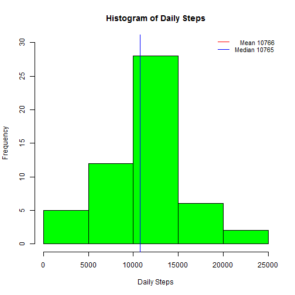
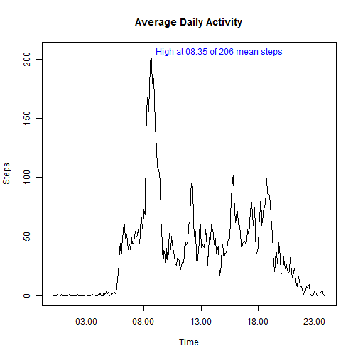
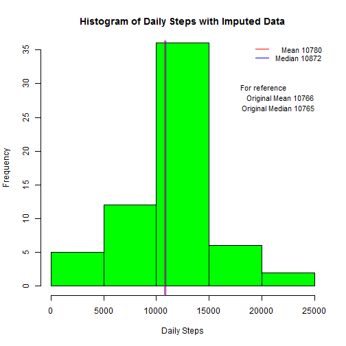
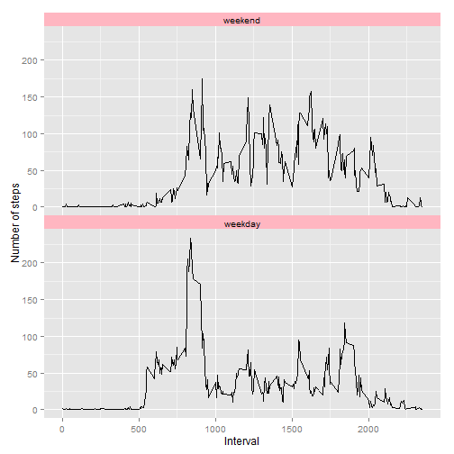
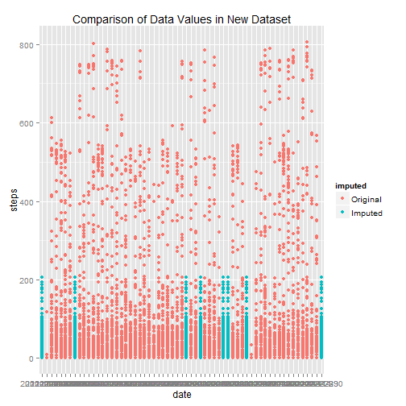

## Loading and preprocessing the data
Here is the code for reading in the dataset.

```r
## name of file in current working directory containing data
fileName <- "activity.csv" 
##If file does not exist then leave error message and stop
if(!file.exists(fileName)){ 
    stop("Unable to find file ",fileName,call. = FALSE)
}
activityDataColClasses = c("integer","character","integer")
activityData <- read.csv(file = fileName, sep = ",", 
                         colClasses =  activityDataColClasses)
library(dplyr)
```

```
## Warning: package 'dplyr' was built under R version 3.2.1
```

```
## 
## Attaching package: 'dplyr'
## 
## The following objects are masked from 'package:stats':
## 
##     filter, lag
## 
## The following objects are masked from 'package:base':
## 
##     intersect, setdiff, setequal, union
```

```r
library(grid) 
library(ggplot2)
```

```
## Warning: package 'ggplot2' was built under R version 3.2.1
```

```r
library(lubridate)
```

```
## Warning: package 'lubridate' was built under R version 3.2.1
```

## What is mean and total number of steps taken per day?
Here is the histogram of the total number of steps taken each day with mean and median reported.  You'll see that the computed median and mean are very close.

```r
by_date <- activityData %>% 
    select(date,steps) %>%
    group_by(date)  %>%
    summarise(sum(steps))
par(mfrow = c(1,1))
hist(by_date$`sum(steps)`,ylim=c(0,30),col="green",xlab="Daily Steps",main = "Histogram of Daily Steps")
dataMean <- mean(na.omit(by_date$`sum(steps)`))
dataMedian  <- median(na.omit(by_date$`sum(steps)`))
abline(v=dataMean,col="red")
abline(v=dataMedian,col="blue")
legendData <- c(paste("   Mean",round(dataMean,0)),paste("Median",round(dataMedian,0)))
legend("topright", bty = "n", cex = .875, lwd = .5, col = c("red", "blue"), xjust = 0, legend = legendData)
```

 

```r
print(paste("Mean is ", round(dataMean), ". Median is ", round(dataMedian), ".",sep=""))
```

```
## [1] "Mean is 10766. Median is 10765."
```

## What is the average daily activity pattern?
Here is a time series plot of the average number of steps taken (averaged across all days) on 5-minute intervals, showing the interval with the maximum number of steps

```r
by_minute <- activityData %>%
    select(interval,steps) %>%
    group_by(interval)  %>%
    summarise(mean(steps,na.rm=TRUE))
xAxisLabel <- strptime(sprintf("%04d",by_minute$interval), "%H%M")
maxSteps <- max(by_minute$`mean(steps, na.rm = TRUE)`)
maxStepsTime <- by_minute$interval[by_minute$`mean(steps, na.rm = TRUE)` == maxSteps]
maxStepsTime <- sprintf("%04d", maxStepsTime)
xText <- strptime(maxStepsTime, "%H%M")
timeMessage <- substr(xText,12,16)
yText <- maxSteps 
par(mfrow = c(1,1))
plot(by_minute$`mean(steps, na.rm = TRUE)`,type="l", x=xAxisLabel, xlab="Time", ylab="Steps", main="Average Daily Activity")
meanMessage <- sprintf ("High at %s of %s mean steps", timeMessage, round(maxSteps))
text(x=xText,y=yText,pos=4,col="blue",labels = meanMessage)
```

 

```r
print(meanMessage)
```

```
## [1] "High at 08:35 of 206 mean steps"
```

## Imputing missing values
Here is the description and code for the strategy used for imputing missing data.

Given that people may have schedules that vary depending on day of the week, the hypothesis is that missing data should be imputed from the average of the same interval and same day of the week across the dataset.  A preliminary exploration of the data set showed that data was missing for complete days, that is from midnight to midnight.  Two days of the week (Monday and Friday) had two days of data missing, with the remaining days of the week each have one missing day's worth of day.  Given no large concentration of missing data would seem to argue against the original theory.

In practice the original proposed approach created a wider difference in median and mean.  Also tried to create a larger sample size of grabbing more intervals centered around the missing interval (i.e. if 12:30 was missing, grab 12:25, 12:30, and 12:35 across same day of week) but this didn't make a big difference in the calculated mean compared to the simipler first approach.  Instead went with a larger sample size of same interval across all days in dataset.

In comparing this histogram with the previous histogram, one will see that both the mean and median have changed, both higher then the original.  Additionally there is a wider spread, suggesting that imputing the data is not helping the variability. 


```r
##Missing rows
missingValues <- (c(sum(is.na(activityData$steps)),sum(is.na(activityData$interval)),sum(is.na(activityData$date))))
data.frame(missingValues,row.names = names(activityData))
```

```
##          missingValues
## steps             2304
## date                 0
## interval             0
```

```r
by_mandd <- activityData %>%
    select(date,interval,steps) %>%
    mutate(steps = as.numeric(is.na(steps))) %>%
    group_by(date) %>%
    summarise(sum(steps)) %>%
    filter(`sum(steps)` > 0) %>%
    mutate(weekday = wday(date,label = TRUE)) %>%
    arrange(weekday) %>% print
```

```
## Source: local data frame [8 x 3]
## 
##         date sum(steps) weekday
## 1 2012-11-04        288     Sun
## 2 2012-10-01        288     Mon
## 3 2012-10-08        288     Mon
## 4 2012-11-14        288     Wed
## 5 2012-11-01        288   Thurs
## 6 2012-11-09        288     Fri
## 7 2012-11-30        288     Fri
## 8 2012-11-10        288     Sat
```

```r
## for missing value, use the mean for same interval and weekday
by_mandd <- activityData %>%
    mutate(day = wday(date)) %>%
    select(interval,steps,day) %>%
    group_by(day,interval)  %>%
    summarise(mean(na.omit(steps)))

names(by_mandd) <-c("day","interval","imputedValue")

newData <- activityData %>% mutate(day = wday(date))

adjData <- function(x){
    steps <- x[1]
    if(is.na(steps)){
        day <- as.numeric(x[4])
        interval <- as.numeric(x[3])
       y <- mean(by_mandd[by_mandd$interval == interval,3]$imputedValue)
        if(is.nan(y) | is.na(y)){
            print(paste(day,interval,  y))
        }
        as.numeric(y)
    }
    else{
        steps;
    }
}
newData$steps <- as.numeric(apply(newData,1,adjData))

by_date <- newData %>% 
    select(date,steps) %>%
    group_by(date)  %>%
    summarise(sum(steps))
hist(by_date$`sum(steps)`,ylim=c(0,35),col="green",xlab="Daily Steps",main = "Histogram of Daily Steps with Imputed Data")
dataMeanImputted <- mean(na.omit(by_date$`sum(steps)`))
dataMedianImputted  <- median(na.omit(by_date$`sum(steps)`))
abline(v=dataMeanImputted,col="red")
abline(v=dataMedianImputted,col="blue")
legendData <- c(paste("   Mean",round(dataMeanImputted,0)),paste("Median",round(dataMedianImputted,0)))
legend("topright", bty = "n", cex = .875, lwd = .5, col = c("red", "blue"), xjust = 0, legend = legendData) 
text(18000,29,cex = .875,adj = c(0,0), paste("For reference"))
text(18000,27.5,cex = .875, adj = c(0,0), paste("   Original Mean",round(dataMean,0)))
text(18075,26,cex = .875, adj = c(0,0), paste("Original Median",round(dataMedian,0)))
```

 

## Are there differences in activity patterns between weekdays and weekends?

There is a noticeable difference in that weekend activity is spread throughout the day, where as weekdays exhibits less activity during middle of the day.

```r
a <- cbind(
    c("Monday","Tuesday","Wednesday","Thursday","Friday","Saturday","Sunday"),
    c("weekday","weekday","weekday","weekday","weekday","weekend","weekend"))
by_minute <- activityData %>%
    select(date,interval,steps) %>%
    ##mutate(day = as.factor(weekdays(as.Date(date)))
    mutate(day = as.factor(a[match(weekdays(as.Date(date)),a),2])) %>%
    group_by(interval,day)  %>%
    summarise(mean(steps,na.rm=TRUE)) %>%
    rename(`Number of steps` = `mean(steps, na.rm = TRUE)`, Interval = interval) 
by_minute$day <- factor(by_minute$day, levels = c("weekend","weekday"))
ggplot(data = by_minute,aes(Interval,`Number of steps`)) + 
    geom_line()+facet_wrap(~day,ncol=1)+
    theme(panel.margin = unit(c(0,0,0,0),"cm"), strip.background = element_rect(fill="lightpink"))
```

 


##Appendix
Exploratory chart used during "Imputed Data" work.


```r
newData <- activityData %>%
        mutate(day = wday(date), imputed = as.factor(is.na(steps))) 
       
levels(newData$imputed) <-   c("Original","Imputed")

newData$steps <- as.numeric(apply(newData,1,adjData))
ggplot(data = newData,aes(date,steps,col=imputed)) + 
    geom_point()+#facet_wrap(~imputed,ncol=1)+
    labs(title = "Comparison of Data Values in New Dataset") +
    theme(panel.margin = unit(c(0,0,0,0),"cm"), strip.background = element_rect(fill="lightpink"))
```

 
